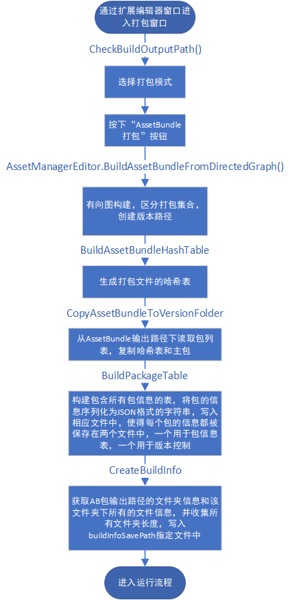
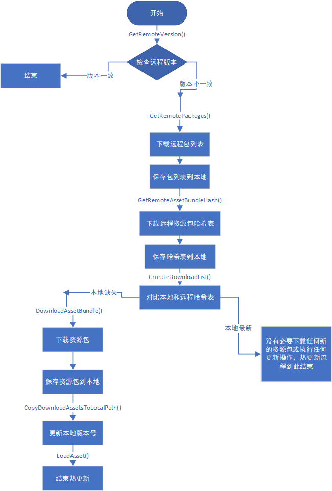
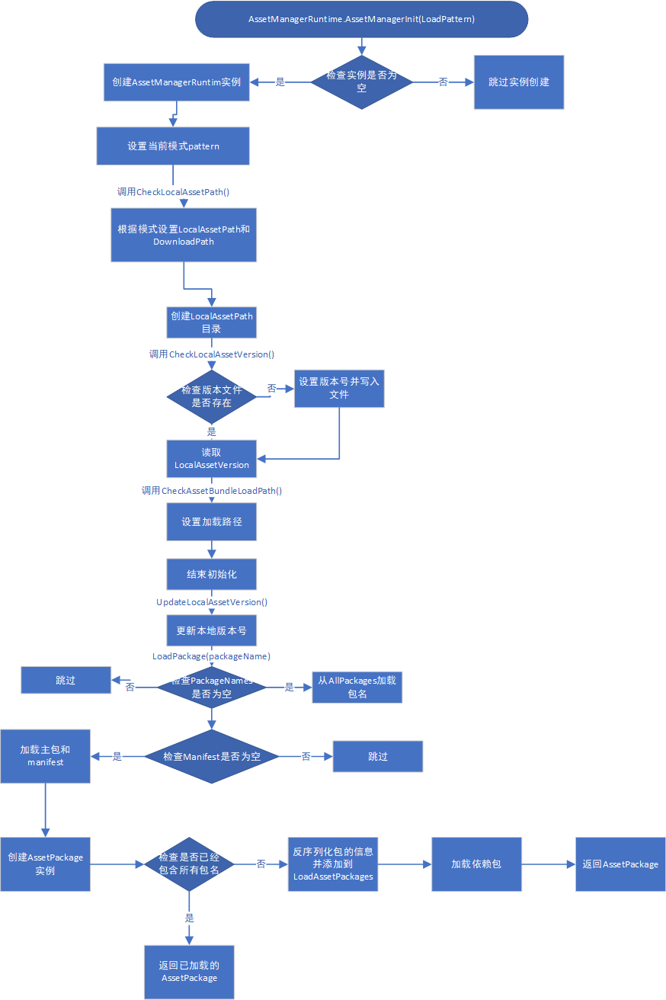
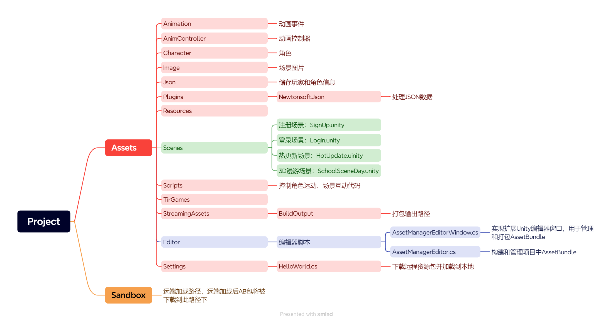

# “热更新实战”项目文档

#### 小组成员及负责内容

- 0210471 王永辉： 搭建部分用户界面（注册界面、登录界面、人物选择界面），3D漫游场景内角色的移动和动画，可互动区域UI文字显示
- 0210485 万怡：实现热更新功能，为所有类和方法变量添加代码注释，编写项目文档
- 0210503 谢爱萍：实现热更新功能，搭建热更新流程界面和场景下载界面，部分可互动区域UI界面互动

## 项目说明

### 一、项目内容

本项目通过Unity引擎，实现3D漫游场景应用，包括热更新功能、用户注册登录界面和3D漫游场景。用户可以通过用户界面进行注册登录，进入热更新界面，然后进入漫游场景进行互动。

#### 热更新功能

- 零冗余：确保更新过程中不产生多余或无用的文件。

- 分包：将更新内容分割成多个小包，以优化下载速度和体验。

- 增量更新：仅下载变更的部分，而非整个项目。

- 断点续传：支持在下载中断后继续传输，而不是重新开始。

- 异步更新：允许在更新进行时进行其他操作，不影响用户体验。

  整个功能分为编辑器部分，和运行时部分。

  编辑器部分就是生成Bundle，生成版本文件等。而运行时部分就是从远端下载版本文件，对比版本号及本地资源是否有要更新的，如果有，则更新，一旦更新完成后就进入漫游场景。没有，则直接进入漫游场景。

#### 用户界面

- 用户注册登陆界面：提供用户输入用户名和密码进行注册登录的界面
- 场景下载界面：下载3D漫游场景
- 热更新流程界面：展示热更新过程，包括对比版本号、对比Package、对比AssetBundle、下载资源等
- 角色模型选择界面：让用户选择不同的角色模型

#### 3D漫游场景

- Navigation导航系统：场景使用Navigation导航系统烘培，以便角色可以在场景中自由移动
- 角色控制：场景中的角色能通过鼠标和键盘控制移动
- 动画状态：角色具有行走、快跑、跳跃、互动四种动画状态
- 可互动区域：与预制体碰撞实现角色变大变小，与场景内角色进行互动，进入互动区域在UI上显示区域名称，机房点击按钮播放视频、篮球场点击按钮播放音乐，地理教室点击按钮使地球仪旋转，足球场控制足球滚动，大礼堂点击按钮开灯出现灯光秀
- 门的功能：所有的门应具备靠近自动打开、远离自动关闭的功能

### 二、项目所用技术

使用AssetBundle与C#脚本结合的方案实现热更新

- 开发平台：Unity 2021.3.37f1
- 实现语言：C#
- 编译环境：Visual Studio 2019
- 3D引擎：Unity内置的3D引擎

## 项目运行流程图

- **打包流程**

- **更新流程**

  

- **加载流程**

  
  

## 项目文件结构图

